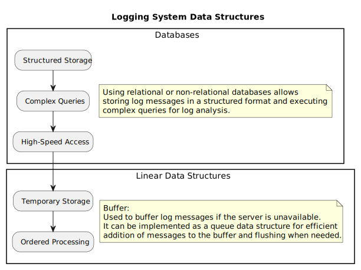

# System Overview

## Features

1. **User Authentication**: The system provides secure user authentication mechanisms to ensure that only authorized users can access its functionalities.
   
2. **Data Management**: It includes features for managing various types of data, such as user profiles, settings, and preferences, in a structured and efficient manner.

3. **Content Management**: The system allows users to create, edit, and manage content, such as documents, images, and multimedia files, with features like version control and collaboration tools.

4. **Communication**: It facilitates communication among users through messaging, notifications, and collaboration features, enabling real-time interaction and feedback.

5. **Search Functionality**: The system offers robust search capabilities, allowing users to quickly find relevant information within the platform.

6. **Reporting and Analytics**: It provides reporting and analytics tools to track system usage, user behavior, and other key metrics, enabling data-driven decision-making and performance evaluation.

7. **Integration**: The system supports integration with third-party services and applications, allowing seamless data exchange and interoperability.

8. **Scalability and Performance**: The system is designed to scale efficiently to accommodate growing user bases and workloads while maintaining optimal performance.

9. **Customization and Extensibility**: It offers customization options and extensibility features, allowing users to tailor the system to their specific needs and integrate additional functionalities as required.

## Components of the System

### Client Library

The client library is responsible for:

- Providing an interface for generating log messages of various levels (info, warning, error, etc.).
- Sending log messages to the logging server over the network.
- Buffering messages if the server is unavailable.

#### Main Modules:

- Logging Interface: API for user applications, providing methods for logging.
- Formatting Module: Formats messages before sending.
- Network Module: Handles the transmission of messages to the server.

### Logging Server

The logging server is responsible for:

- Receiving log messages from clients.
- Storing messages in log files or outputting them to stdout.
- Filtering and aggregating log messages.

#### Main Modules:

- Network Module: Receives requests from client libraries.
- Message Processing Module: Processes received messages, ensuring they are filtered and aggregated.
- Storage Module: Handles writing logs to files or outputting to stdout.

## Communication between Subsystems


Communication between subsystems within the system architecture is vital for seamless operation and data flow. Here's how different components interact:

### Client Library

The client library serves as a bridge between user applications and the logging server. Its primary responsibilities include:

- **Logging Interface**: Provides an API for user applications to generate log messages of various levels, such as info, warning, error, etc.
- **Sending Log Messages**: Transmits log messages to the logging server over the network.
- **Message Buffering**: Buffers log messages if the server is unavailable, ensuring no data loss.

#### Main Modules:

1. **Logging Interface**: Exposes methods for user applications to log messages.
2. **Formatting Module**: Formats messages before transmission.
3. **Network Module**: Handles message transmission to the logging server.

### Logging Server

The logging server acts as a central hub for receiving, processing, and storing log messages from client libraries. Its key functionalities include:

- **Receiving Log Messages**: Accepts log messages from client libraries over the network.
- **Message Handling**: Processes received messages, applying filters and aggregating data as necessary.
- **Storage Management**: Stores log messages in files or outputs them to stdout for further analysis.

#### Main Modules:

1. **Network Module**: Listens for incoming requests from client libraries.
2. **Message Processing Module**: Processes received messages, ensuring proper filtering and aggregation.
3. **Storage Module**: Manages the storage of log messages, either writing them to files or outputting them to stdout.

## System Characteristics

The system exhibits several key characteristics that define its behavior and performance:

1. **Scalability**: The system is designed to scale efficiently to handle increasing loads and user demands. Both the client library and logging server can scale horizontally to accommodate more clients and messages.

2. **Reliability**: Reliability is crucial for logging systems, ensuring that log messages are not lost and are reliably stored for later analysis. The client library incorporates message buffering to prevent data loss during network failures, while the logging server employs robust storage mechanisms to ensure message persistence.

3. **Flexibility**: The system offers flexibility in configuring log message formats, filtering criteria, and storage options. Users can customize log message formats and apply filters based on their specific requirements. Additionally, the logging server supports various storage backends, allowing users to choose between file-based storage or real-time output to stdout.

4. **Performance**: Performance is a critical aspect of the system, particularly in terms of message transmission, processing, and storage. The client library optimizes network communication for minimal latency, while the logging server employs efficient message processing algorithms to handle large volumes of log messages without significant performance degradation.

5. **Fault Tolerance**: The system is designed to tolerate faults and failures gracefully, ensuring uninterrupted operation even in the face of network outages, server crashes, or other disruptions. Redundancy and failover mechanisms are employed to minimize downtime and maintain system availability.

6. **Extensibility**: The system architecture supports extensibility, allowing for easy integration of additional features, modules, or third-party components. Users can extend the functionality of the client library or logging server through custom plugins, adapters, or integrations with external systems.

## Input/Output

The system's input and output mechanisms facilitate the exchange of log messages between client applications and the logging server:

1. **Input**:
   - **Client Library**: The primary input source for the system is client applications utilizing the client library. These applications generate log messages based on predefined events or conditions within the software. Log messages are categorized into different levels such as info, warning, error, etc.
   - **Logging Interface**: Within the client library, the logging interface serves as the entry point for generating log messages. Applications call methods provided by this interface to log messages at various levels.
   
2. **Output**:
   - **Logging Server**: The logging server serves as the primary output destination for log messages received from client applications. It receives log messages over the network from multiple client libraries.
   - **Storage Module**: Upon receiving log messages, the logging server processes and stores them using the storage module. Log messages can be stored in log files on disk or output in real-time to stdout, depending on the configuration.

## Software Performance

### Stand Description

The software performance of the system refers to its ability to efficiently handle log message generation, transmission, processing, and storage while maintaining acceptable response times and resource utilization levels.

### Metrics

The performance of the system can be evaluated based on various metrics, including but not limited to:

| Metric                         | Description                                                  |
|-------------------------------|--------------------------------------------------------------|
| Throughput                     | The rate at which log messages are processed and stored.     |
| Response Time                  | The time taken to process and acknowledge log messages.      |
| Resource Utilization           | CPU, memory, and network usage during peak load conditions.  |
| Error Rates                    | Frequency of errors encountered during log processing.       |
| Scalability                    | Ability of the system to handle increased loads.             |

### Charts

Charts depicting performance metrics over time, such as throughput trends, response time distributions, and resource utilization graphs, can provide insights into the software's performance characteristics and help identify areas for optimization.


## Graphical User Interface
In the logging system architecture depicted, there is an absence of a Graphical User Interface (GUI) component. Unlike many software systems where a GUI provides an interface for user interaction, the logging system primarily focuses on backend functionality for storing and managing log messages.

The absence of a GUI suggests that interactions with the logging system are likely to be performed programmatically or through command-line interfaces rather than through graphical elements. This is common in server-side applications where direct user interaction is minimal, and the emphasis is on efficient data handling and processing.

The lack of a GUI simplifies the system design, reducing overhead related to graphical rendering and user interaction components. Instead, the system can prioritize functionalities such as robust logging mechanisms, efficient data storage, and accessibility for automated processes or administrative tasks.

# Sequence Diagrams
This sequence diagram demonstrates the flow of events where the client generates a log message, sends it to the logging server through the client library, the logging server receives, processes, and stores the message, and finally acknowledges the receipt back to the client.


<details>
@startuml SequenceDiagram

actor Client
participant "Client Library" as ClientLib
participant "Logging Server" as LoggingServer

Client -> ClientLib: Generate log message
ClientLib -> ClientLib: Format log message
ClientLib -> LoggingServer: Send log message
activate LoggingServer
LoggingServer -> LoggingServer: Receive log message
LoggingServer -> LoggingServer: Process log message
LoggingServer -> LoggingServer: Store log message
LoggingServer -> ClientLib: Acknowledge receipt
ClientLib -> Client: Acknowledge receipt

@enduml
</details>

# Data Structures

This diagram illustrates the architecture of the data structures of the logging system, consisting of two main components:

1. **Databases**: This component depicts the usage of relational or non-relational databases for storing log messages. Databases enable structured storage of log data, execution of complex queries for log analysis, and high-speed access through features like indexing and query optimization.

2. **Linear Data Structures**: This component represents a buffer used for temporarily storing log messages in case the server is unavailable. The buffer can be implemented as a queue data structure, facilitating efficient addition and flushing of log messages as needed.



<details>

```
@startuml DataStructures

title Logging System Data Structures

rectangle "Databases" {
    note right: Using relational or non-relational databases allows \nstoring log messages in a structured format and executing \ncomplex queries for log analysis.

    - Structured Storage
    - Complex Queries
    - High-Speed Access
}

rectangle "Linear Data Structures" {
    note right: Buffer:\nUsed to buffer log messages if the server is unavailable. \nIt can be implemented as a queue data structure for efficient \naddition of messages to the buffer and flushing when needed.

    - Temporary Storage
    - Ordered Processing
}

@enduml
```
</details>

# Interfaces

### 1. Command-Line Interface (CLI)

The logging system offers a command-line interface (CLI) for manual interaction and administrative tasks. The CLI allows system administrators or users to perform operations such as querying logs, configuring logging settings, and monitoring system status directly from the command line interface.

Key functionalities of the CLI include:
- **Log Query Commands**: Commands for querying log data based on specified criteria, such as time range or log level.
- **Configuration Commands**: Commands for configuring logging settings, including log levels, output destinations, and formatting options.
- **Status Commands**: Commands for checking the status of the logging system, such as current log volume, system uptime, and error statistics.

### 2. Library Interface

For integration with software applications, the logging system provides a library interface that developers can include in their codebases. This interface allows applications to generate log messages directly from the code and customize logging behavior based on application requirements.

Key components of the library interface include:
- **Log Generation Methods**: Methods or functions for generating log messages within the application code, specifying message content, severity level, and other metadata.
- **Configuration Options**: Configuration parameters for customizing logging behavior, such as log output format, logging level thresholds, and error handling policies.
- **Integration Support**: Support for integrating with popular programming languages and frameworks, ensuring compatibility with a wide range of software environments.
