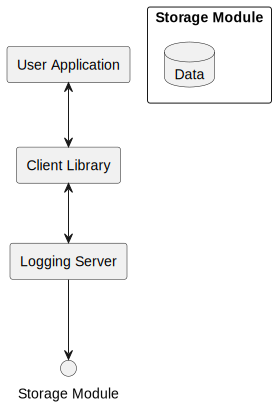
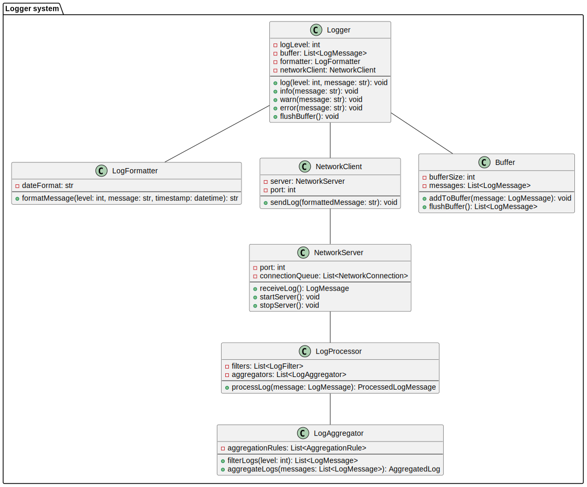

# Software Requirements Specification of the Logging System

## 1. Introduction

The logging system consists of a client library and a logging server. The client library integrates into user applications and provides an interface for sending log messages to the server. The logging server collects these messages and stores them in specific files or outputs them to stdout.

## 2. Components of the System

### 2.1. Client Library

The client library is responsible for:

- Providing an interface for generating log messages of various levels (info, warning, error, etc.).
- Sending log messages to the logging server over the network.
- Buffering messages if the server is unavailable.

#### Main Modules:

- Logging Interface: API for user applications, providing methods for logging.
- Formatting Module: Formats messages before sending.
- Network Module: Handles the transmission of messages to the server.

### 2.2. Logging Server

The logging server is responsible for:

- Receiving log messages from clients.
- Storing messages in log files or outputting them to stdout.
- Filtering and aggregating log messages.

#### Main Modules:

- Network Module: Receives requests from client libraries.
- Message Processing Module: Processes received messages, ensuring they are filtered and aggregated.
- Storage Module: Handles writing logs to files or outputting to stdout.

## 3. Component Interaction

- User Application calls a logging method with the desired message.
- Client Library formats the message and sends it to the logging server.
- Logging Server receives the message, processes it, and stores it in a file or outputs it to stdout.

## 4. Data Flows

- Inbound Flow: Log messages from the client library to the logging server.
- Outbound Flow: Logged messages written to files or output to stdout.

## 5. Architectural Diagram


<details>

```
@startuml systemArchitectureDiagram

skinparam defaultFontName Arial

' Define components
rectangle "User Application" {
}

rectangle "Client Library" {
}

rectangle "Logging Server" {
}

rectangle "Storage Module" as storage {
  database "Data" as data
}

' Define relationships
"User Application" <--> "Client Library"
"Client Library" <--> "Logging Server"
"Logging Server" --> "Storage Module"

@enduml
```

</details>


User application invokes Logger methods for event logging.
Logger uses Log Formatter to format messages and Network Client to send them to the server. In case the server is unavailable, messages are stored in Buffer.
Network Server receives messages, which are then processed by Log Processor.
Log Processor forwards processed messages to Storage for storage or output.
Log Aggregator can filter and aggregate log messages for further analysis.

## Conclusion

The described structure of the logging system project components ensures efficient collection, processing, and storage of log messages. This allows for easy scalability of the system and expansion of its functionality according to user needs.



<details>

```
@startuml systemComponents

skinparam defaultFontName Arial

package "Logger system" {
    class Logger {
        - logLevel: int
        - buffer: List<LogMessage>
        - formatter: LogFormatter
        - networkClient: NetworkClient
        --
        + log(level: int, message: str): void
        + info(message: str): void
        + warn(message: str): void
        + error(message: str): void
        + flushBuffer(): void
    }

    class LogFormatter {
        - dateFormat: str
        --
        + formatMessage(level: int, message: str, timestamp: datetime): str
    }
    
    class LogProcessor {
        - filters: List<LogFilter>
        - aggregators: List<LogAggregator>
        --
        + processLog(message: LogMessage): ProcessedLogMessage
    }
    
    class LogAggregator {
        - aggregationRules: List<AggregationRule>
        --
        + filterLogs(level: int): List<LogMessage>
        + aggregateLogs(messages: List<LogMessage>): AggregatedLog
    }

    class NetworkClient {
        - server: NetworkServer
        - port: int
        --
        + sendLog(formattedMessage: str): void
    }

    class NetworkServer {
        - port: int
        - connectionQueue: List<NetworkConnection>
        --
        + receiveLog(): LogMessage
        + startServer(): void
        + stopServer(): void
    }

    class Buffer {
        - bufferSize: int
        - messages: List<LogMessage>
        --
        + addToBuffer(message: LogMessage): void
        + flushBuffer(): List<LogMessage>
    }
}

NetworkClient -- NetworkServer
NetworkServer -- LogProcessor
LogProcessor -- LogAggregator
Logger -- LogFormatter
Logger -- NetworkClient
Logger -- Buffer

@enduml
```

</details>

## Assumption and Dependencies

No specific assumptions or dependencies were provided in the diagram.

# Specific Requirements

## Interfaces

- **Logging Interface**: The product must provide a logging interface for recording log messages of various levels (e.g., info, warning, error).
- **Configuration Interface**: Users should be able to configure the logging level (e.g., DEBUG, INFO, WARNING, ERROR).
- **Formatting Interface**: There should be an interface for formatting log messages before they are stored.
- **Buffer Size Configuration Interface**: Users should be able to set the size of the buffer for storing log messages.
- **Network Interface**: The product should support sending log messages to a network server.

## Functional Requirements

The functional requirements include:

- **Logging**: The product must be capable of logging messages at different levels, such as informational, warning, and error.
- **Configuration**: Users should be able to configure the logging level to filter out less severe messages.
- **Formatting**: The product should allow users to format log messages according to their preferences before storing them.
- **Buffering**: There should be a mechanism to buffer log messages to avoid data loss during high load periods.
- **Network Logging**: The product should have the capability to send log messages to a network server for remote monitoring and storage.

# Data Requirements

No specific data requirements were provided. Typically, log data includes information such as timestamp, log level, message, and possibly additional context or metadata.
